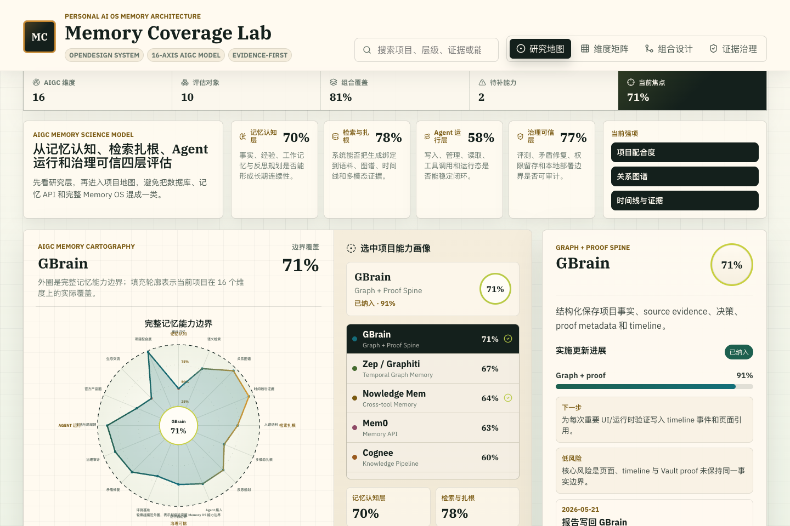
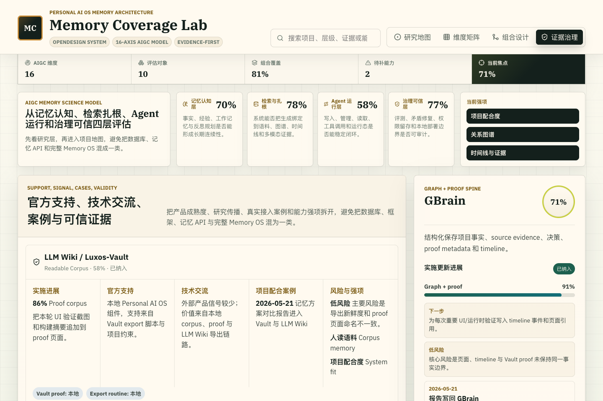

# Memory Coverage Lab

Interactive research workbench for comparing agent-memory projects across a complete AIGC memory capability boundary.

Live site: <https://veritaswiki.github.io/memory-coverage-lab/>

## Why It Exists

Memory products, vector databases, local knowledge graphs, and agent runtimes are often compared as if they solve the same problem. This lab separates the layers:

- What capability boundary does a project cover?
- What evidence supports that coverage?
- How far has the project been implemented inside the Personal AI OS stack?
- Which tools should be combined instead of treated as replacements?

## What It Shows

- A clear boundary profile for the selected project across 16 research dimensions.
- A ranked selector for comparing project coverage without cluttering the boundary chart.
- The matrix view compares every project dimension by dimension with a research lens label.
- The stack planner calculates combined coverage by taking the strongest capability from selected projects.
- The governance view separates implementation progress, official support, technology signal, cases, risks, and strongest capabilities.
- The implementation ledger tracks phase, progress, owner/system lane, next milestone, risk, and update history.

## Projects Included

LLM Wiki / Luxos-Vault, GBrain, Hindsight, Nowledge Mem, VikingDB / OpenViking, Mem0 / Supermemory, Zep / Graphiti, Cognee, Letta, and LangMem / LangGraph.

## Tech Stack

- React 19
- TypeScript
- Vite
- Vitest
- ESLint
- OpenDesign-derived Memory OS design system

## Screenshots





## Development

```bash
pnpm install
pnpm dev
pnpm lint
pnpm typecheck
pnpm test
pnpm build
```

The dev server is configured for LAN access:

```text
http://192.168.31.22:5179/
http://luxdeMac-mini.local:5179/
http://100.119.246.9:5179/
```

## OpenDesign

OpenDesign is configured under `opendesign/`:

- `opendesign/index.html` viewer copied from the local OpenDesign GitHub checkout.
- `opendesign/design-systems/memory-os/` contains the design system.
- `opendesign/mockups/memory-coverage-lab/index.html` contains the high-fidelity mockup.
- `opendesign/manifest.json` indexes the viewer content.

## Scoring Model

Coverage numbers are heuristic research scores, not vendor benchmarks. They compare each project against 16 AIGC memory capability dimensions grouped into four layers:

1. Memory cognition: event memory, reflection/planning, and project fit.
2. Retrieval and grounding: semantic retrieval, relational graph, timeline/proof, human-readable corpus, and multimodal grounding.
3. Agentic runtime: agent hooks, runtime boundary, official product surface, and ecosystem signal.
4. Assurance and governance: evaluation benchmarks, contradiction repair, governance/audit, and local/LAN deployment.

## Deployment

The project deploys to GitHub Pages through `.github/workflows/pages.yml`.

The workflow runs:

```bash
pnpm lint
pnpm typecheck
pnpm test
pnpm build
```

The Vite config uses `base: "./"` so the static build works from the GitHub Pages project path.
